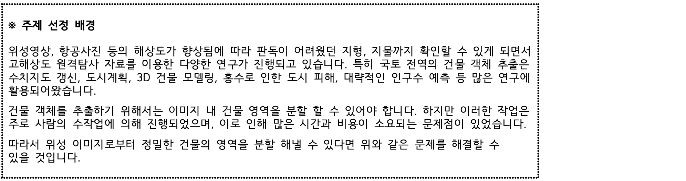

# 🛰️SW중심대학 공동 AI 경진대회 2023 (Satellite Image Building Area Segmentation)   
[PIXEL Team]  
  [ColdTbrew](https://github.com/ColdTbrew)  
  [hyjk826](https://github.com/hyjk826)  
  [uijinee](https://github.com/uijinee)  
  [junghyun2moon](https://github.com/junghyun2moon)

## Index
- [대회 사이트](#대회-사이트)
- [주제 선정 배경](#주제-선정-배경)
- [InternImage 🌃](#internimage-🌃)
  - [Installation](#internimage-🌃)
  - [Pretrained Checkpoints](#pretrained-checkpoints)
  - [How to start training](#how-to-start-training)
  - [How to start inference](#how-to-start-inference)
- [SWINv2 🌌](#swinv2-🌌)
  - [Installation](#swinv2-🌌)
  - [Pretrained path](#pretrained-path)
  - [Pretrained Checkpoints](#pretrained-checkpoints-1)
  - [How to start training](#how-to-start-training-1)
  - [How to start inference](#how-to-start-inference-1)
- [Mask2Former 🖼️](#mask2former-🖼️)
  - [Installation](#mask2former-🖼️)
  - [Pretrained Checkpoints](#pretrained-checkpoints-2)
  - [How to start training](#how-to-start-training-2)
  - [How to start inference](#how-to-start-inference-2)
- [Ensemble 🎯](#ensemble-🎯)
  - [앙상블 스크립트](#앙상블-스크립트)
  - [추가 앙상블](#추가-앙상블)
  - [시스템 환경](#시스템-환경)

## 대회 사이트
   [데이콘]( https://dacon.io/competitions/official/236092/overview/description)

## 주제 선정 배경



# InternImage 🌃

[Installation](https://github.com/OpenGVLab/InternImage/blob/master/segmentation/README.md)

## Pretrained Checkpoints

1. INTERN_best_mDice_iter_336000.pth  
   [Download Link](https://drive.google.com/file/d/1B2ieT2W_I-tp-yjzfR7_sOoKfQK8sj7R/view?usp=drive_link)

2. INTERN_k1_best_mDice_iter_210000.pth  
   [Download Link](https://drive.google.com/file/d/1X-1BNwz0eQ4AV2eqtzdBtenS2i5bPAyW/view?usp=drive_link)

3. INTERN_k3_best_mDice_iter_220000.pth  
   [Download Link](https://drive.google.com/file/d/1MvktQmj8wdS1PNDlLoPUvT4b4zOxyAEN/view?usp=sharing)

4. INTERN_k4_best_mDice_iter_280000.pth  
   [Download Link](https://drive.google.com/file/d/1ijjzE5yT190OEeIHdn1_t27Q-y0Mk7vO/view?usp=drive_link)

## How to start training

```
   cd mmseg_0.x.x
   python segmentation/train.py work_dirs/no4/INTERN_config.py
```


## How to start inference

```
   cd mmseg_0.x.x
   python segmentation/inference.py
```


# SWINv2 🌌

[Installation](mmseg_1.x.x/docs/en/get_started.md)

## Pretrained path

1. Swin Pretrained pth  
   [Download Link](https://download.openmmlab.com/mmsegmentation/v0.5/pretrain/swin/swin_large_patch4_window12_384_22k_20220412-6580f57d.pth)

## Pretrained Checkpoints

1. swin_best_mDice_iter_320000.pth (160k + 160k)   
   [Google Drive Link](https://drive.google.com/file/d/1fI4Zfn_rKznJbPGee37jaEuZb_bO8fDK/view?usp=drive_link)

## How to start training

1. Training:  
   ```
   cd mmseg_1.x.x
   python tools/train.py work_dirs/swin/swin_config.py
   ```

## How to start inference

```
cd mmseg_1.x.x
python work_dirs/swin/infer.py
```


# Mask2Former 🖼️

[Installation](mmseg_1.x.x/docs/en/get_started.md)

## Pretrained Checkpoints

1. m2f_K2_best_mDice_iter_90000.pth  (90k)  
   [Google Drive Link](https://drive.google.com/file/d/1NHI02wH_hzVNtEsWXzRa23MlH903W7an/view?usp=drive_link)

2. m2f_K3_best_mDice_iter_90000.pth (90k + 90k)    
   [Google Drive Link](https://drive.google.com/file/d/199AWAwd8n758zGUQIJlDVl_wd3dz1AwT/view?usp=drive_link)

3. m2f_K4_best_mDice_iter_90000.pth (90k + 90k)    
   [Google Drive Link](https://drive.google.com/file/d/1C637rkVaIV14SmdTHMzFM4SYQp-ceY6e/view?usp=drive_link)

## How to start training

1. K2 Training:  
   ```
   cd mmseg_1.x.x
   python tools/train.py work_dirs/mask2former/m2f_config_k2.py
   ```

2. K3 Training:  
   ```
   cd mmseg_1.x.x
   python tools/train.py work_dirs/mask2former/m2f_config_k3.py
   ```
      
3. K4 Training:  
   ```
   cd mmseg_1.x.x
   python tools/train.py work_dirs/mask2former/m2f_config_k4.py
   ```
   
## How to start inference

```
cd mmseg_1.x.x
python work_dirs/mask2former/infer_m2f.py
```


# Ensemble 🎯
[Ensemble](post_processing/ensemble/ensemble.py)
1. Swin (단일 모델)
2. internimage 
   - best_mDice_iter_336000 + k1 + k3 + k4 (threshold = 2)
3. mask2former
   - k2 + k3 + k4 (threshold = 2)

**last submit**  
swin + internimage + mask2former (threshold = 2)

## Extra ensemble
[Ensemble_by_weight](post_processing/ensemble/ensemble_by_weight.py)  
점수를 최대한 높이기 위해 csv 앙상블의 단점인 threshold를 다양하게 적용해 보기 위해 여러 제출 .csv 파일을
이용해 각각 submit.csv의 public score를 기준으로 각각 가중치를 주어 앙상블 후 ensemble8_21_th0.35.csv 생성해
최고 public score를 0.8226를 도달함

## System environment: 🖥️

- sys.platform: linux
- Python: 3.8.5 (default, Sep  4 2020, 07:30:14) [GCC 7.3.0]
- CUDA available: True
- numpy_random_seed: 1545188287
- GPU 0: A100-SXM4-40GB
- CUDA_HOME: /usr/local/cuda
- NVCC: Cuda compilation tools, release 11.0, V11.0.221
- GCC: gcc (Ubuntu 9.3.0-17ubuntu1~20.04) 9.3.0
- PyTorch: 1.12.1

PyTorch compiling details:
- GCC 9.3
- C++ Version: 201402
- Intel(R) oneAPI Math Kernel Library Version 2021.4-Product Build 20210904 for Intel(R) 64 architecture applications
- Intel(R) MKL-DNN v2.6.0 (Git Hash 52b5f107dd9cf10910aaa19cb47f3abf9b349815)
- OpenMP 201511 (a.k.a. OpenMP 4.5)
- LAPACK is enabled (usually provided by MKL)
- NNPACK is enabled
- CPU capability usage: AVX2
- CUDA Runtime 11.3
- NVCC architecture flags: -gencode;arch=compute_37,code=sm_37;-gencode;arch=compute_50,code=sm_50;-gencode;arch=compute_60,code=sm_60;-gencode;arch=compute_61,code=sm_61;-gencode;arch=compute_70,code=sm_70;-gencode;arch=compute_75,code=sm_75;-gencode;arch=compute_80,code=sm_80;-gencode;arch=compute_86,code=sm_86;-gencode;arch=compute_37,code=compute_37
- CuDNN 8.3.2 (built against CUDA 11.5)
- Magma 2.5.2
- Build settings: BLAS_INFO=mkl, BUILD_TYPE=Release, CUDA_VERSION=11.3, CUDNN_VERSION=8.3.2, CXX_COMPILER=/opt/rh/devtoolset-9/root/usr/bin/c++, CXX_FLAGS=-fabi-version=11 -Wno-deprecated -fvisibility-inlines-hidden -DUSE_PTHREADPOOL -fopenmp -DNDEBUG -DUSE_KINETO -DUSE_FBGEMM -DUSE_QNNPACK -DUSE_PYTORCH_QNNPACK -DUSE_XNNPACK -DSYMBOLICATE_MOBILE_DEBUG_HANDLE -DEDGE_PROFILER_USE_KINETO -O2 -fPIC -Wno-narrowing -Wall -Wextra -Werror=return-type -Wno-missing-field-initializers -Wno-type-limits -Wno-array-bounds -Wno-unknown-pragmas -Wno-unused-parameter -Wno-unused-function -Wno-unused-result -Wno-unused-local-typedefs -Wno-strict-overflow -Wno-strict-aliasing -Wno-error=deprecated-declarations -Wno-stringop-overflow -Wno-psabi -Wno-error=pedantic -Wno-error=redundant-decls -Wno-error=old-style-cast -fdiagnostics-color=always -faligned-new -Wno-unused-but-set-variable -Wno-maybe-uninitialized -fno-math-errno -fno-trapping-math -Werror=format -Werror=cast-function-type -Wno-stringop-overflow, LAPACK_INFO=mkl, PERF_WITH_AVX=1, PERF_WITH_AVX2=1, PERF_WITH_AVX512=1, TORCH_VERSION=1.12.1, USE_CUDA=ON, USE_CUDNN=ON, USE_EXCEPTION_PTR=1, USE_GFLAGS=OFF, USE_GLOG=OFF, USE_MKL=ON, USE_MKLDNN=OFF, USE_MPI=OFF, USE_NCCL=ON, USE_NNPACK=ON, USE_OPENMP=ON, USE_ROCM=OFF,

- TorchVision: 0.13.1
- OpenCV: 4.8.0
- MMEngine: 0.8.2

## Runtime environment:

- cudnn_benchmark: True
- mp_cfg: {'mp_start_method': 'fork', 'opencv_num_threads': 0}
- dist_cfg: {'backend': 'nccl'}
- seed: 1545188287
- Distributed launcher: none
- Distributed training: False
- GPU number: 1

